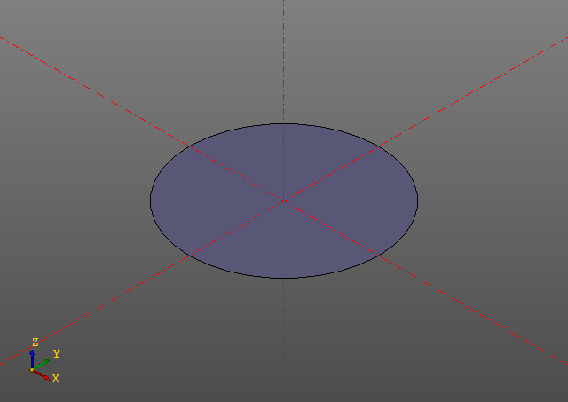
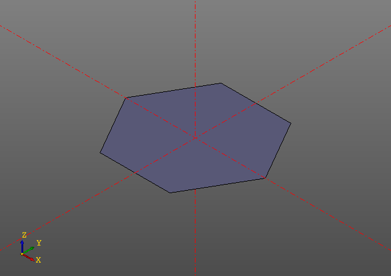

# 2д Примитивы.

## Circle
```python
circle(r = radius)
```

Example:
```python
zencad.circle(r = 10)
```


## Ngon
```python
ngon(r = radius, n = nums)
```

Example:
```python
zencad.ngon(r = 10, n = 6)
```
