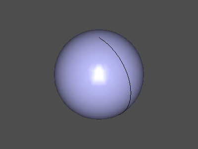
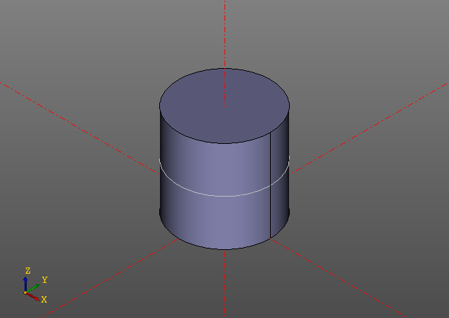
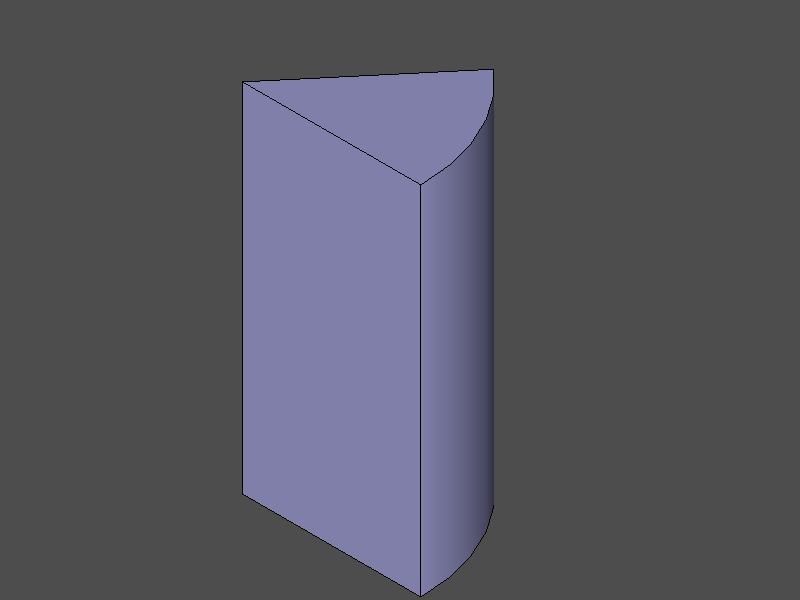
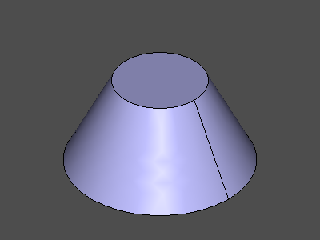
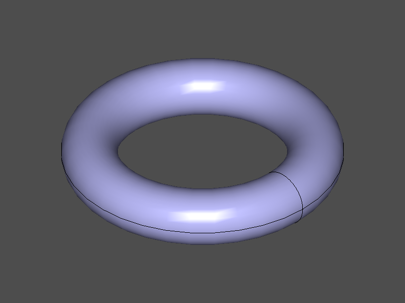

# 3d Примитивы

## Box  

box(x, y, z, center = True/False);
box(size = (x,y,z), center = True/False);
box(size = x, center = True/False);


Example:
```python
zencad.box(size = [20, 20, 10], center = True)
```


## Sphere  

sphere(r = radius)


Example:

zencad.sphere(r = 10)



## Cylinder  

cylinder(r = radius, h = height, center = True/False);


Example:

zencad.cylinder(r = 10, h = 20)
zencad.cylinder(r = 10, h = 20, angle=50)

 

## Cone  

cone(r1 = botRadius, r2 = topRadius, h = height, center = True/False);


Example:

zencad.cone(r1 = 20, r2 = 10, h = 20, center = True)



## Torus  

torus(r1 = centralRadius, r2 = localRadius);


Example:

zencad.torus(r1 = 10, r2 = 3);

