# Topology-dependent operations

Some operations require a particular topological element of a model. In an interactive CAD system, you can select it with the mouse. Scripted CAD needs another approach. One ZenCad option is the "nearest point" method: pass a point instead of the element, and the closest element is selected.

For explicit selection of edges and faces, use [topology selectors](selectors.html).

---
## Fillet
Rounds a shape: edges for a solid, vertices for a planar shape. Specify a radius `r` and an array of reference points `refs`. `refs=None` selects all elements.

```python
fillet(model, radius, referencedPoints)
fillet(model, radius)
model.fillet(radius, referencedPoints)
model.fillet(radius)
```
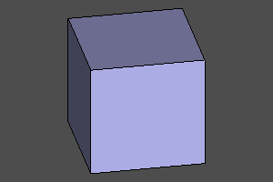 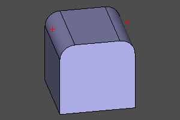 </br>
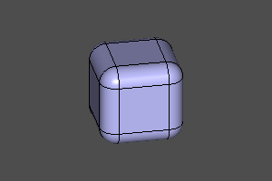 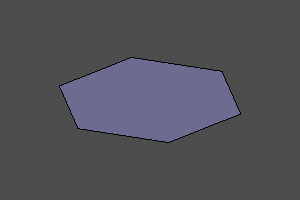 </br>
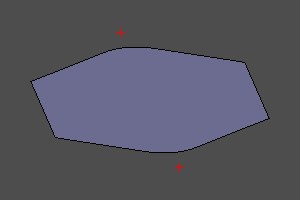 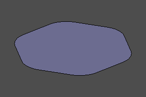

---
## Chamfer
Chamfers a body. Unlike fillet, it applies only to solids. `r` is the distance from the edge to the chamfer boundary; `refs` is an array of reference points. `refs=None` selects all elements.

```python
chamfer(model, radius, referencedPoints)
```
 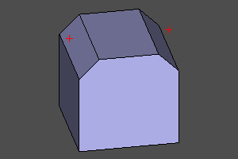 </br>
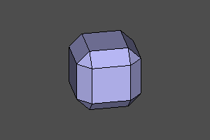 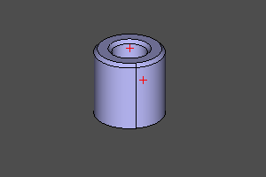

---
## Face draft

`draft` tilts selected faces relative to a neutral plane—for example, to help remove a part from a mold. A positive angle removes material along the pull direction; a negative angle adds it. The neutral plane remains fixed.

The default direction is `+Z`, with the neutral plane through the origin and perpendicular to that direction. `neutral` also accepts a planar face or an `(origin, normal)` pair. Selected faces must belong to the original body and be planar, cylindrical or conical.

```python
body = box(20)
side_faces = body.faces().filter_by_position(Axis.Z, 10)

narrower = draft(body, side_faces, deg(5))
wider = draft(body, side_faces, deg(-5))
midplane = draft(
    body,
    side_faces,
    deg(5),
    neutral=((0, 0, 10), (0, 0, 1)),
)
```

---
## Thicksolid
Creates a thin-walled solid from a prototype `shp`. `refs` contains points nearest to the faces to remove. Wall thickness `t` is measured outward when positive and inward when negative.

```python
thicksolid(model, t=thickness, refs=referencedPoints)
```

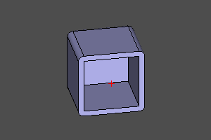 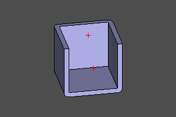

## Result types and element selection

`fillet()` and `chamfer()` return `Shape`; inspect the contents with `faces()` and `solids()`. Even a result containing one solid retains the `Shape` wrapper.

For nearest-element selection, pass a list of `point3(...)` or `Vertex` objects. For explicit edge selection, pass a list of `Edge` objects from the original body. Edges and points cannot be mixed. Plain coordinate tuples in the reference list are not supported; use `point3`. `None` selects all elements, while an empty list raises `ValueError`. Edges from another model are rejected. For filleting a planar face, select vertices or points.
