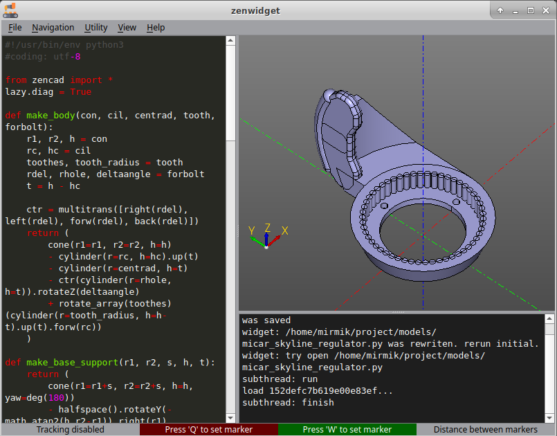

# Graphical interface: the basics

---
## Launching
There are several ways to open the graphical interface:

* Calling `show()` in a Python script opens a standalone viewer in the script process; the commands below launch the full editor.
* Running `python3 -m zencad` in a terminal (usage: `python3 -m zencad [filepath]`).
* Running the `zencad` command-line utility (usage: `zencad [filepath]`).

---
## Updating the model when the source changes
The viewer watches the geometry source file and automatically reruns the script when it changes. The editor starts a separate script worker and receives a scene snapshot. The viewer and camera persist between evaluations. If the script fails, the last successful result remains visible. See [Inside ZenCad](internal.html).

---
## Built-in text editor
The viewer includes a text editor for quick edits and experiments. Toggle it with `View/'Hide editor'`.

---
## Built-in console
ZenCad also forwards terminal output to its built-in console. Toggle it with `View/'Hide console'`.
This is useful when the main terminal is unavailable.

---
## Markers and coordinates
Use `Q(F1)` and `W(F2)` to place markers. Each marker's coordinates appear in the corresponding field. When both markers are set, the Distance field shows the distance between them.

---
## 3D navigation
Rotation: MouseLeftClick/Alt + MouseMove 
Pan: MouseMiddleClick/MouseRightClick/Shift + MouseMove 
Zoom: PgUp/PgDown/MouseWheel

Choose a navigation scheme in `Edit/Settings`: ZenCad, Legacy ZenCad,
Blender, FreeCAD CAD, Maya or Custom. Custom lets you assign Rotate, Pan
and Zoom gestures separately. You can also invert the wheel and rotation direction.

The viewer supports two orientation modes: upright orientation (Z always points up) and free rotation. Switch between them with `Navigation/'Axionometric view'` and `Navigation/'Free rotation view'`.
