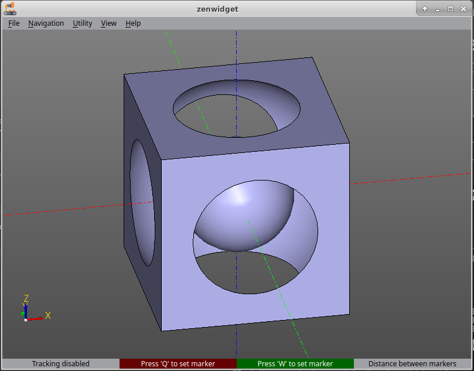

# Hello, friend.

Here is an example showing how models are built in ZenCad.
```python
from zencad import *

a = box(200, 200, 200, center = True)
b = sphere(120)
c = sphere(60)

model = a - b + c

display(model)

show()
```

------------------
## What happens:
```python
from zencad import *
```
The first line imports ZenCad's names into the current namespace. Here we need `box`, `sphere`, `display` and `show`.
</br>
</br>

```python
a = box(200, 200, 200, center = True)
b = sphere(120)
c = sphere(60)
```
We prepare the geometric primitives: a box measuring 200×200×200, centered at the origin, and two spheres with radii 120 and 60.
</br>
</br>

```python
model = a - b + c
```
We build the model with boolean operations. First, the larger sphere is subtracted from the cube. Then the smaller sphere is added. The order matters because subtraction of geometric bodies is not commutative.
</br>
</br>

```python
disp(model)
```
`disp` adds the object to the scene for display.
</br>
</br>

```python
show()
```
We display the scene widget.

---------------------------
## If everything went well:

