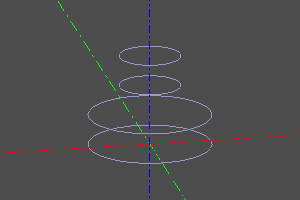
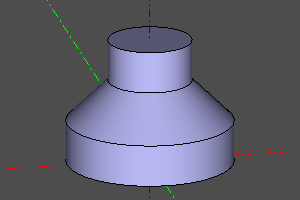
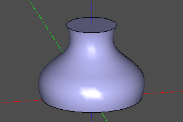
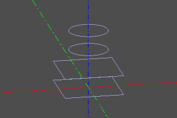
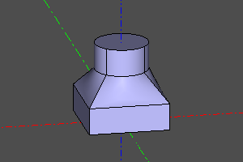
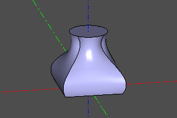

# Geometry from existing shapes

---
## Offset
Builds a thicker or thinner version of _proto_ by offsetting its shells by _r_. A positive _r_ offsets outward; a negative _r_ offsets inward.

Signature:
```python
offset(proto, distance)
```

Example:
```python
offset(cone(r1=15,r2=10,h=20), 5)
```


---
## Ruled surface
Builds a face on a ruled surface between curves _a_ and _b_.

Signature:
```python
ruled(a, b)
```

Example:
```python
ruled(circle(r=20, wire=True), circle(r=20, wire=True).up(20))
ruled(circle(r=20, wire=True), circle(r=20, wire=True).rotZ(math.pi/2*3).up(20))
ruled(
    interpolate([(0,0),(-4,10),(4,20),(-6,30),(6,40)]),
    interpolate([(0,0),(-2,10),(2,20),(-4,30),(4,40)]).up(20),
)
```

  </br>
 

---
## Loft
Builds a shape through an array of wire _profiles_. The _shell_ option creates a shell instead of a solid. The _smooth_ option switches from ruled surfaces to smooth approximation. When approximation is enabled, _maxdegree_ limits the polynomial degree.

Signature:
```python
loft(profiles, smooth=False, shell=False, maxdegree=4)
```

Example:
```python
profiles = [circle(10, wire=True), circle(15, wire=True).up(20),
            circle(8, wire=True).up(40)]
body = loft(profiles, smooth=True)
shell = loft(profiles, smooth=True, shell=True)
```

  </br>
  </br>
 

`loft(..., shell=False)` returns a `Solid` and requires closed profiles to build a valid solid. For open profiles, use `shell=True` to get a `Shell`. An open profile with `shell=False` raises `ValueError` identifying the profile. This check runs when the operation is evaluated; use `result.validate()` to check for other geometry defects.
