# Lines and loops

Solid and planar primitives are not always enough to build the geometry you need. The more advanced operations in this manual can construct bodies from arbitrary curves.

_ZenCad_ and the OpenCascade kernel have two classes of one-dimensional geometry: _Edge_ and _Wire_. An _Edge_ is a simple primitive; joining several edges into a composite curve produces a _Wire_. They can often be used interchangeably, but the distinction matters when inspecting a model's topology.

A collection of _Wire_ and/or _Edge_ objects can be joined with _sew_ (described below).

Closed curves are called loops. If a loop and all its constituent curves lie in one plane, _fill_ can turn it into a face (see "Planar primitives").

Additional operations are described in "Curve analysis".

---
## Segment
An ordinary line segment, specified by two points.

Signature:
```python
segment(pnt1, pnt2)
```
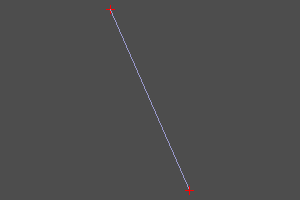

---
## Polysegment
A polysegment is a polyline specified by an array of points, `pnts`. Setting `closed` adds a segment from the final point back to the first.

Signature:
```python
polysegment(pnts, closed=False)
```
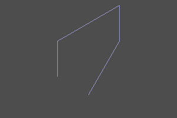 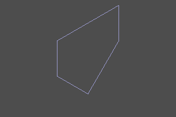

---
## Interpolation through points
Builds an interpolated curve through _pnts_. The optional _tangs_ parameter specifies a tangent direction at each point (`None` leaves it unconstrained). Setting `closed` adds a closing curve segment.

Signature:
```python
interpolate(pnts, tangs=None, closed=False)
```
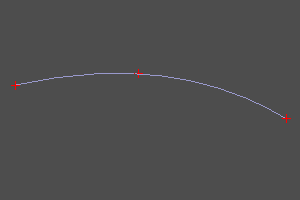 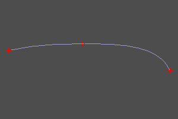 </br>
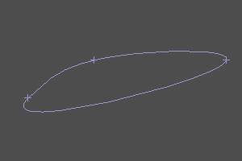 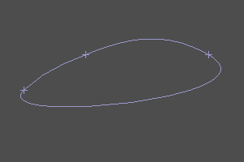

---
## Circular arc through three points
An alternative to _circle_ (see [Planar primitives](prim2d.html)) for creating a circular arc, using three points.

Signature:
```python
circle_arc(p1, p2, p3) 
```
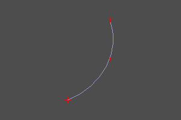

---
## Helix
An ascending helix specified by radius _r_, height _h_ and pitch _step_. Setting _left_ changes right-handed winding to left-handed winding. The optional _angle_ makes the radius vary with height along a cone.

Signature:
```python
helix(r, h, step, angle=angle, left=False)
```
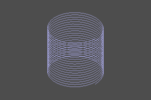 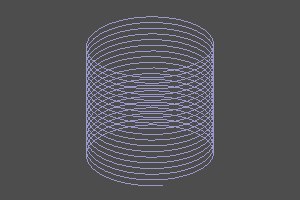 </br>
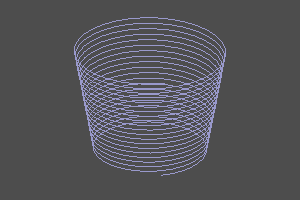 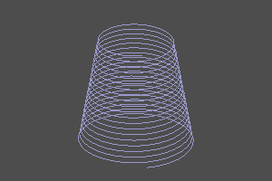

---
## Bézier curve
A Bézier curve ([wiki](https://en.wikipedia.org/wiki/B%C3%A9zier_curve)), specified by control points and optional weights. Omitted weights are all one.

Signature:
```python
bezier(pnts)
bezier(pnts, weights)
```
 

---
## BSpline
Creates a BSpline by specifying its parameters directly.

Signature:
```python
bspline(pnts, knots, muls, degree, periodic=False)
bspline(pnts, knots, muls, degree, weights=weights, check_rational=True)
```

`knots` gives parameter values; `muls` gives their multiplicities. For example, a cubic curve with four control points and clamped endpoints:

```python
from zencad import *

curve = bspline(
    [(0, 0, 0), (10, 20, 0), (20, -10, 0), (30, 0, 0)],
    knots=[0, 1], muls=[4, 4], degree=3,
)
display(curve)
show()
```

---
## Rounded polysegment
Adds circular arcs at the joins between line segments. _r_ sets the fillet radius. It can be used with `pipe_shell` (see sweep surfaces). Setting `closed` closes the curve with a rounded join.

Signature:
```python
rounded_polysegment(pnts, r, closed=False)
```

Example:
```python
rounded_polysegment(
	pnts=[(0,0,0), (20,0,0), (20,20,40), (-40,20,40), (-40,20,0)], 
	r=10)
```


---
## Creating a composite curve
_sew_ assembles a composite curve from the parts in _wires_.

The parts can be Edge and Wire objects ([geometric types](https://mirmik.github.io/zencad/en/geomcore.html)).

Parts must meet at their endpoints and follow the correct order. If _sort_ is set, the algorithm attempts to order them automatically.

Signature:
```python
sew(wires, True) # sort is positional; default: True
```

Example:
```python
sew([
	segment((0,0,0), (0,10,0)), 
	circle_arc((0,10,0),(10,15,0),(20,10,0)), 
	segment((20,0,0), (20,10,0)),
	segment((20,0,0), (0,0,0))
])
```
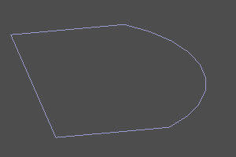

---
# Wire builder
Builds a curve one section at a time, starting each edge at the previous edge's endpoint. Operations accept absolute or relative coordinates. In relative mode, control-point coordinates are added to the builder's current position. _rel_ selects the mode: False for absolute, True for relative. If omitted, _defrel_ is used.

Constructor arguments:<br>
_start_ — starting point<br>
_defrel_ — default coordinate mode

```python
wb = wire_builder(start=(0,0,0), defrel=False)
``` 

---
### Restarting
Restarts at a new point and clears the edge list.
```python
wb.restart(pnt, y=None, z=None)
```

```python
wb.restart(point3(10,15,0))
wb.restart(10,15)
```

---
### Adding a segment
Builds a segment to _pnt_.
```python
wb.segment(pnt, y=None, z=None, rel=None)
wb.line(b, y=None, z=None, rel=None)
wb.l(b, y=None, z=None, rel=None)

```

```python
wire_builder(defrel=True).restart((0,10)).l(10,0).l(0,-10).close().doit() # draw a square
```


-----
### Adding a circular arc through points
```python
wb.arc_by_points(a,b,rel=None)
```

---
### Adding an interpolated curve
_curtang_ sets the curve direction at the starting point. Setting _approx_ derives _curtang_ from the direction at the end of the preceding section.
```python
wb.interpolate(pnts, tangs=None, curtang=(0,0,0), approx=False, rel=None)
```

### Closing
_close_ builds a section back to the starting point. `approx_a` and `approx_b` enable interpolation at the closing joins.

```python
wb.close(approx_a=False, approx_b=False)
```

## The finished contour

`.doit()` returns the constructed `Wire`. The contour can be filled and extruded into a body:

```python
from zencad import *

contour = (wire_builder(start=(0, 0, 0))
           .segment((30, 0, 0))
           .arc_by_points((40, 10, 0), (30, 20, 0))
           .segment((0, 20, 0))
           .close()
           .doit())
body = fill(contour).extrude(5)
display(body)
show()
```
