# Flat primitives.
This section introduces flat primitives. They are usually used in conjunction with 3D operations to construct bodies with complex geometry. 

---
## Rectangle
The flat primitive is a rectangle. Set by two sides. It is permissible not to indicate the second side, which will correspond to the construction of the square. Setting the _center_ option aligns the geometric center of the body with the origin. When the _wire_ option is set, a rectangle loop will be generated instead of a filled face.

Сигнатура:
```python
rectangle(x, y, center=False, wire=False)
rectangle(a, center=False, wire=False)
square(a, center=False, wire=False) #alternate
```
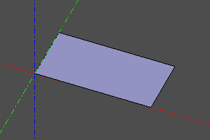 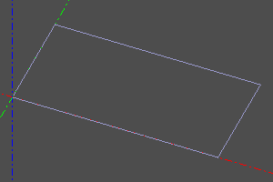 </br> 
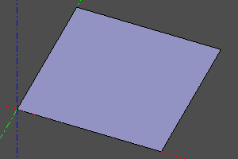 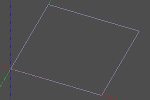 

---
## Circle / Circle
The circle is given by the radius _r_. Setting the optional _angle_ option allows you to generate a sector of a circle / arc of a circle.
When the _wire_ option is set, a wireframe circle will be generated instead of a filled circle face. 

Сигнатура:
```python
circle(r=radius, wire=False)
circle(r=radius, angle=angle, wire=False)
circle(r=radius, angle=(start, stop), wire=False)
```
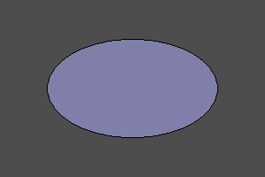 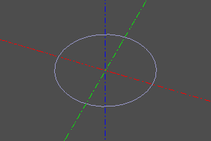   </br>
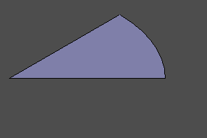 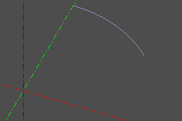  

---
## Ellipse
The flat primitive is an ellipse. It is specified by two radii, and _r1_ must be greater than _r2_. You can also draw a wedge by specifying an angle or a pair of angles as the optional _angle_ parameter.
When the _wire_ option is set, a wireframe will be generated instead of a filled face. 

Сигнатура:
```python
ellipse(r1=major, r2=minor, wire=False)
ellipse(r1=major, r2=minor, angle=angle, wire=False)
ellipse(r1=major, r2=minor, angle=(start, stop), wire=False)
```
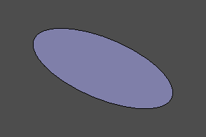 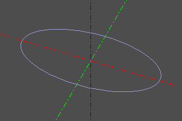   </br>
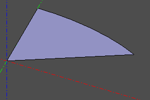 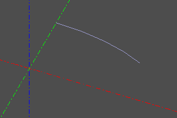  

---
## Polygon
A flat primitive is a polygon. Constructed by vertex points.
When the _wire_ option is set, a wireframe will be generated instead of a filled face (which is similar to a closed polysegment.).
_pnts_ is an array of vertex points. 

Сигнатура:
```python
polygon(points=pnts, wire=False)
```
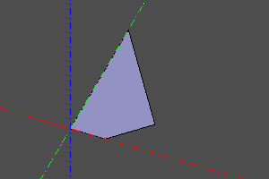 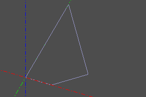  

---
## Regular polygon
A flat primitive is a regular polygon. The radius and the number of vertices are set.
When the _wire_ option is set, a wireframe will be generated instead of a filled face. 

Сигнатура:
```python
ngon(r=radius, n=vertexCount, wire=False)
```
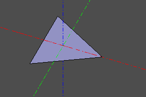 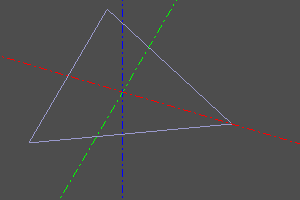  </br> 
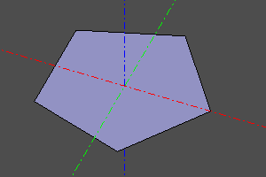 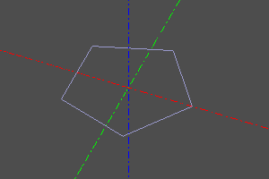  </br> 
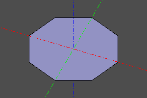 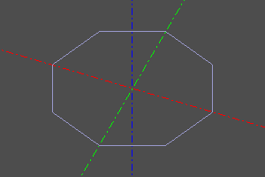  

---
## Text shape
The flat primitive is text. Returns a `Compound` containing glyph faces based on string `text` and name of font `fontname` with font size `size`. The font is selected from those registered in the system. To register additional fonts use `register_font` command. The `composite_curve` option reduce the number of edges in the resulting shape by increasing their complexity.

Сигнатура:
```python
textshape(text, fontname, size, composite_curve=False)
```
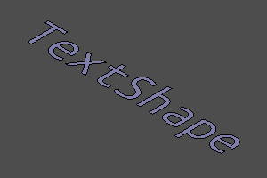 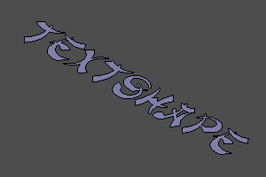  

---
## Infinite Plane
An infinite plane is a special geometric object that can be used in some operations on other objects.
An infinite plane cannot be displayed directly. 

Сигнатура:
```python
infplane()
```

Пример (Построение конических сечений):
```python
cone(r1=5, r2=0, h=10, center=True) ^ infplane()
cone(r1=5, r2=0, h=10, center=True).rotX(deg(45)) ^ infplane()
cone(r1=5, r2=0, h=10, center=True) ^ infplane().rotX(deg(45))
cone(r1=5, r2=0, h=10, center=True) ^ infplane().rotX(deg(90)).right(3)
```
  </br> 
   

----------------------------------
## Filling the outline
This operation is applied to the flat closed line _wire_ and turns it into a face. 

Сигнатура:
```python
fill(wire)
wire.fill() #alternate
```

Пример:
```python
wire = sew([
	segment((0,0,0), (0,10,0)), 
	circle_arc((0,10,0),(10,15,0),(20,10,0)), 
	segment((20,0,0), (20,10,0)),
	segment((20,0,0), (0,0,0))
])
fill(wire)
```

|До|После|
|--|--|
||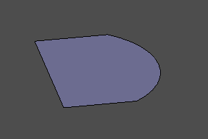|


----------------------------------
## Interpolate a surface over an array of points
Builds a bspline surface by interpolating a 2D array of points. The array is specified by a two-dimensional list.
degmin and degmax define the minimum and maximum degrees of the interpolation polynomial, respectively. 

Сигнатура:
```python
interpolate2(pnts, degmin=3, degmax=7)
```

Пример:
```python
POINTS = points2([
		[(0,0,0), (10,0,7), (20,0,5)],
		[(0,5,0), (10,5,7.5), (20,5,7)],
		[(0,10,2), (10,10,8), (20,10,5)],
		[(0,15,1.3), (10,15,8.5), (20,15,6)],
	])

m = interpolate2(POINTS)
disp(m)
disp(POINTS, color=color.red)
```


