# Solids
This section covers the basic primitives of CSG geometry.

---
## Box
A box is defined by three dimensions: _x_, _y_ and _z_. A single dimension _a_ creates a cube _(a, a, a)_. `center=True` places the center of the box at the origin. A string selects the axes to center along: `box(10, 20, 30, center="xy")` spans −5 to 5 in X, −10 to 10 in Y, and 0 to 30 in Z.

Signatures:
```python
box(x, y, z, center=False)
box(size=(x,y,z), center=False)
box(size=a, center=False)
```

Examples:
```python
box(10, 20, 30, center=False)
box(size=(10,20,30), center=False) # alternate
box(10, center=True)
```

 

---
## Sphere
A sphere is defined by its radius. The optional _yaw_ and _pitch_ parameters create spherical sectors.

Signature:
```python
sphere(r=radius, yaw=yaw, pitch=(minPitch, maxPitch))
```

Examples:
```python
sphere(10)
sphere(10, yaw=math.pi*2/3)
sphere(10, pitch=(deg(20), deg(60)))
sphere(10, yaw=deg(120), pitch=(deg(20), deg(60)))
```
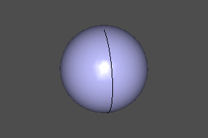 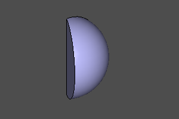 </br>
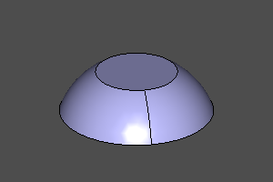 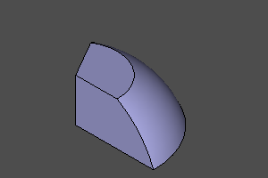

---
## Cylinder
A cylinder is defined by its radius and height. The optional _yaw_ parameter creates a cylindrical sector. With `center=True`, the midpoint of its height lies at Z=0.

Signature:
```python
cylinder(r=radius, h=height, yaw=yaw, center=False)
```

```python
cylinder(r=10, h=20)
cylinder(r=10, h=20, yaw=deg(45))
cylinder(r=10, h=20, center=True)
cylinder(r=10, h=20, yaw=deg(45), center=True)
```

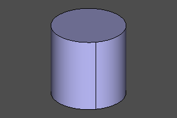 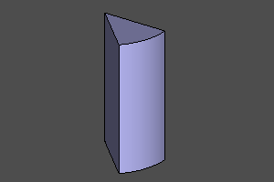 </br>
 

---
## Cone
A cone is defined by its lower radius _r1_, upper radius _r2_ and height. The optional _yaw_ parameter creates a conical sector. With `center=True`, the midpoint of its height lies at Z=0. Either radius may be zero to create a pointed cone.

Signature:
```python
cone(r1=botRadius, r2=topRadius, h=height, yaw=yaw, center=False)
```

Examples:
```python
cone(r1=20, r2=10, h=20)
cone(r1=20, r2=10, h=20, yaw=deg(45))
cone(r1=0, r2=20, h=20)
cone(r1=20, r2=0, h=20, center=True)
```

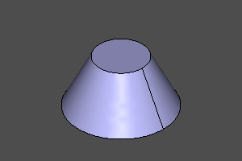 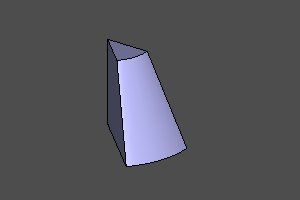 </br>
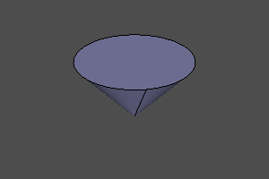 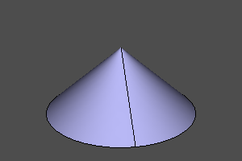

---
## Torus
A torus is defined by its major radius _r1_ and minor radius _r2_. The optional _yaw_ and _pitch_ parameters create toroidal sectors.

If the _pitch_ interval excludes the inner portion, a cylindrical insert fills the corresponding region in the center. If it excludes the outer portion, that part of the torus is bounded by a plane.

Signature:
```python
torus(r1=centralRadius, r2=localRadius, yaw=yaw, pitch=(minPitch, maxPitch))
```

Examples:
```python
torus(r1=20, r2=5)
torus(r1=20, r2=5, yaw=deg(120))
torus(r1=20, r2=5, pitch=(deg(-20), deg(120)))
torus(r1=20, r2=5, pitch=(deg(-20), deg(120)), yaw=deg(120))
torus(r1=20, r2=5, pitch=(deg(-140), deg(140)), yaw=deg(120))
torus(r1=20, r2=5, pitch=(deg(-20), deg(190)), yaw=deg(120))
```

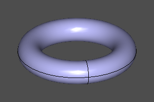 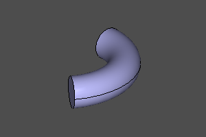 </br>
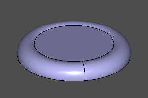 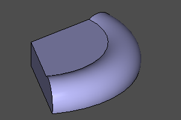 </br>
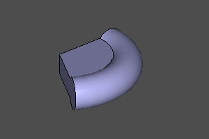 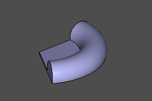

---
## Half-space
A special solid representing the lower half-space. Like other solids, it supports transformations and can be positioned to represent any half-space. It cannot be displayed directly. Use it with difference and intersection operations.

```python
sphere(r=10) - halfspace().rotateX(deg(150))
sphere(r=10) ^ halfspace().rotateX(deg(150))
```
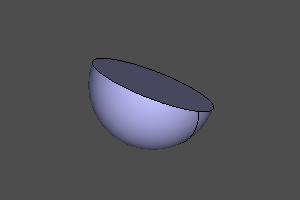 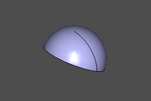

--------------------
## Platonic solids

Constructing Platonic solids.
The implementation is based on https://github.com/qalle2/plato.scad

|Regular polyhedron|Vertices|Edges|Faces|Sides per face|Edges per vertex|Symmetry group|
| --- |--- |--- |--- |--- |--- |--- |
| Tetrahedron | 4 | 6 | 4 | 3 | 3 | Td |
| Hexahedron | 8 | 12 | 6 | 4 | 3 | Oh |
| Octahedron | 6 | 12 | 8 | 3 | 4 | Oh |
| Dodecahedron | 20 | 30 | 12 | 5 | 3 | Ih |
| Icosahedron | 12 | 30 | 20 | 3 | 5 | Ih |

Set the size using the circumscribed radius _r_ or the edge length _a_.

Signatures:
```python
zencad.tetrahedron(r=1, a=None, shell=False)
zencad.hexahedron(r=1, a=None, shell=False)
zencad.octahedron(r=1, a=None, shell=False)
zencad.dodecahedron(r=1, a=None, shell=False)
zencad.icosahedron(r=1, a=None, shell=False)

# Alternative syntax
zencad.platonic(nfaces, r=1, a=None, shell=False)
```

Example:
```python
# By radius:
tetrahedron(10)
hexahedron(10)
octahedron(r=10)
dodecahedron(r=10)
icosahedron(10)

# By edge length:
icosahedron(a=10)

# Alternative syntax:
zencad.platonic(4, 10)
zencad.platonic(6, 10)
zencad.platonic(8, 10)
zencad.platonic(12, 10)
zencad.platonic(20, 10)
```

  </br>
  </br>

