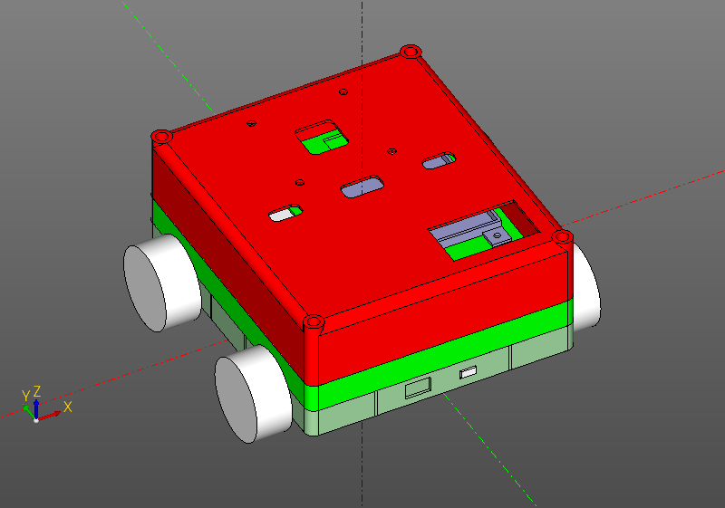

# Скриптовые CAD системы.

Script CAD stand apart from the generally accepted interactive CAD. If in interactive CAD you create a model with the mouse and a set of tools on the left or on the panel, then in script CAD you write the program on which your model is built. Thus, the generated model defaults to good parameterizability and regularization. If, when changing basic geometry parameters in interactive CAD, you may need to redraw the entire model, in script CAD you just need to replace a couple of constants.

On the other hand, scripted CAD may not be very user friendly. You need to have a certain skill to read the model in the form of program code. Nevertheless, the success of OpenScad shows the need for humanity in tools of this type.

Script CAD is good at writing machine parts and other products with precisely aligned and well-grounded surfaces. But an attempt to draw on it the Venus de Milo will not lead to anything good. For artistic purposes there is another class of systems.

Strictly speaking, although the “CAD system for righteous zen programmers” is written in the ZenCad motto, ZenCad by design is more a library with cad functionality than a complete CAD system. ZenCad was designed as a tool that can integrate with the libraries of the python ecosystem in order to solve problems of building analytic surfaces, visualizing data from a semi-natural modeling, and more.

