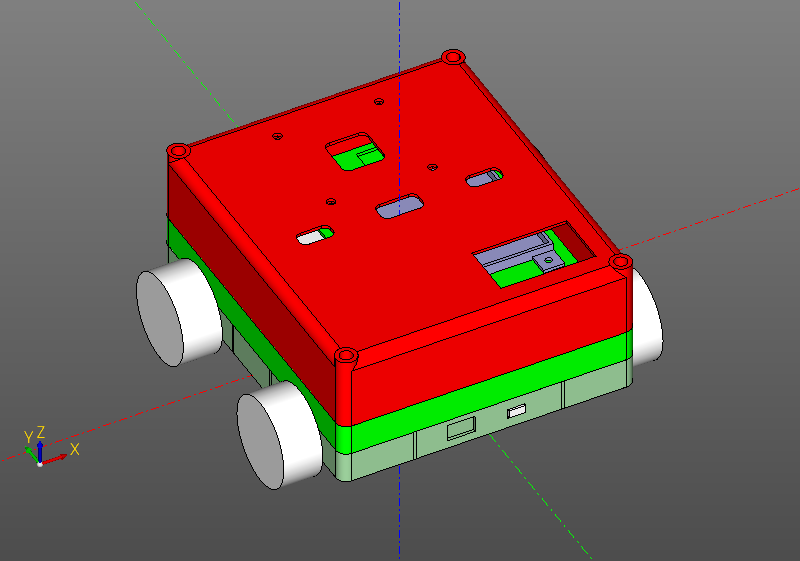

# Scripting CAD systems.

Scripted CAD stands apart from mainstream interactive CAD. If in interactive CAD you create a model using the mouse and a set of tools in the panel on the left or above, then in scripted CAD you write the program on which your model is built. Thus, the generated model gets good parameterization and regularization by default. If, when changing the basic geometry parameters in interactive CAD, you may need to redraw the entire model, in scripted CAD you just need to replace a couple of constants.

On the other hand, scripting CAD may not be very user friendly. You need to have some skill to read the model in the form of program code. However, the success of OpenScad demonstrates the human need for this type of tool.

Scripted CAD is good at writing machine parts and other products with precisely aligned and grounded surfaces. But an attempt to draw Venus de Milo on it will not lead to anything good. For artistic purposes, there is another class of systems.

Strictly speaking, although the motto of zencad says "CAD system for righteous programmers", zencad by design is more of a library with CAD functionality than a complete CAD system. zencad was designed as a tool that can integrate with the libraries of the python ecosystem in order to solve the problems of constructing analytical surfaces, visualizing semi-natural modeling data and other tasks involving the integration of the python ecosystem libraries with the zoo.  (???? Gogle translate is so translate...)

