# Trajectory sweep.

A wide class of reference geometry operations is represented by operations, constructing a body by translation (English sweep) of a certain profile or a family of profiles (_profile_, _profiles_) along a given trajectory _spine_.

## Formally about what a trajectory sweep is:

Trajectory sweep is a technique for constructing a surface by sweeping a profile along a path. In general, the profile view is not constant and can change according to certain laws. Thus, there are two questions regarding how the profile extends along the trajectory, or, in other words, we must define two laws, namely:

1. The law that determines the shape of the trajectory.
2. The law determining the shape of the profile.

It is convenient to split the second law into two sub-laws:
1.1. The law that determines the shape of the translated body.
1.2. The law governing the angular evolution of the basis.

In fact, the variety of all trajectory translation operations available in the system are different forms of answers to these questions.

----------------------

## Linear sweep.
The most commonly used method of adding volume to a flat object. The operation unfolds the flat body _face_ along the vector _vec_. Specifying a single coordinate instead of a vector will stretch the model in the positive Z direction.
If the center option is specified, after the operation is performed, the model will be translated in the direction opposite to vec by its half length.

Сигнатура:
```python
extrude(face, (x,y,z), center=False)
extrude(face, z, center=False) #equal: vec=(0,0,z)
face.extrude(vec) #alternate
```

Пример:
```python
ngon(r=10, n=10)
ngon(r=10, n=10).extrude(4)
extrude(ngon(r=10, n=10), (1, 0, 4))
register_font(FONTPATH)
extrude(textshape(text="TextShape", fontname=FONTNAME, size=100), 20)
```

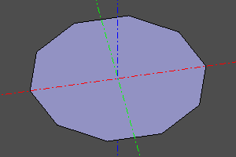 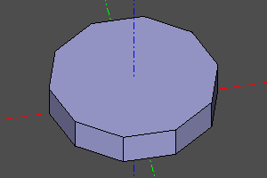 </br>  
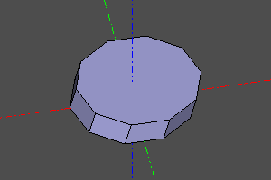 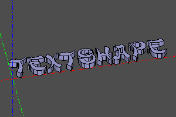

--------------------------
## Tube
Sweep a circular profile with `pipe_shell`. Subtract two sweeps to form a hollow tube. Place the profile at the start of the spine, perpendicular to its initial direction.

```python
from zencad import *

spine = interpolate(
    points([(0, 0, 0), (0, 0, 35), (20, 0, 55), (45, 15, 65)]),
    tangs=[vector3(0, 0, 1), None, None, vector3(1, 1, 0)],
)
outer = pipe_shell([circle(6, wire=True)], spine, frenet=True)
inner = pipe_shell([circle(4, wire=True)], spine, frenet=True)
body = outer - inner
disp(body)
```

 

---
## Sweep a profile along a path. Sweep with a variable profile.
The operation constructs a body from one profile or a set of successive _profiles_ profiles, stretched along the _spine_ path.
Specifying the _frenet_ option activates the law of variation of the angular position of the profile in accordance with the Frenet-Serre trihedron. The _binormal_ option activates the law of variation of the angular position of the profile in accordance with the constant binormal.

Сигнатура:
```python
pipe_shell(profiles, spine, frenet=False, binormal=None, solid=True)
```

Примеры:
```python
spine = segment((0, 0, 0), (0, 0, 40))
profiles = [circle(10, wire=True), circle(5, wire=True).up(40)]
body = pipe_shell(profiles, spine)
```

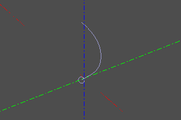 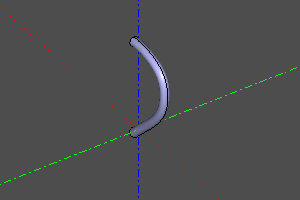  </br>
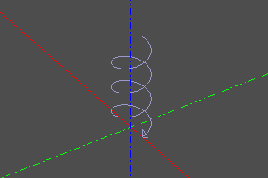 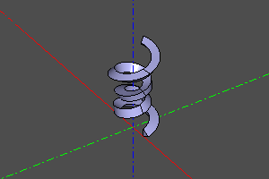  </br>
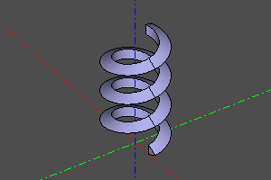

---
## Body of rotation.
The operation of creating a body of revolution from the _proto_ prototype. If it is necessary to create a sector, the angle _yaw_ is set.
If radius _r_ is specified, the object is rotated 90 degrees around the X axis and displaced along the X axis by a distance equal to the radius _r_.

Сигнатура:
```python
revol(profile, r=None, yaw=deg(360))
```

Пример:
```python
profile = rectangle(5, 12).rotateX(deg(90)).right(15)
body = revol(profile)
sector = revol(profile, yaw=deg(120))
```

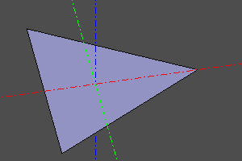 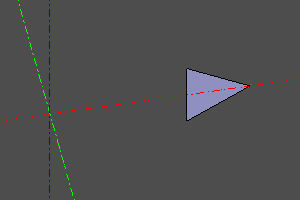  </br>
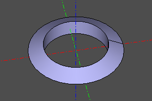 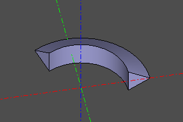  

---
## Body of rotation. (extended version).
An extended version of the _revol_ operation. Constructs a body of revolution from the prototype _proto_ at the interval of the rotation angle _yaw_. Specifying the _roll_ option allows you to change the rotation angle of the prototype as it traverses the interval. The body is built from reference copies of the prototype body, the number of copies is set by the _n_ option. _parts_ defines the number of segments of the resulting rotation body.

Сигнатура:
```python
revol2(profile, r, n=30, yaw=(0,deg(360)), roll=(0,0), parts=None)
```

Примеры:
```python
revol2(profile=square(10, center=True), r=20, n=60, yaw=(0,deg(360)), roll=(0,deg(360)))
```


## Result types

`extrude()` and `revol()` return `Shape`; extract a single solid with `result.solids().only()`. `pipe_shell(..., solid=True)` returns `Solid` and requires closed profiles; an open profile raises `ValueError` at evaluation, identifying its index. With `solid=False`, it returns `Shell` and permits open profiles. `revol2()` with the parameters of the example above returns `Solid`.
