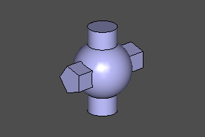
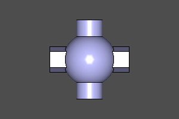
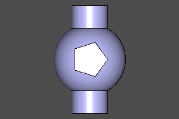
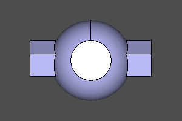
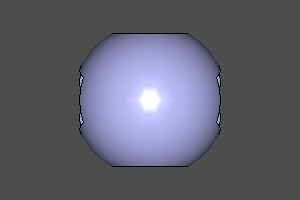
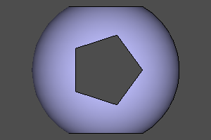
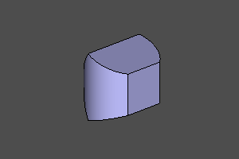
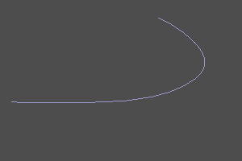
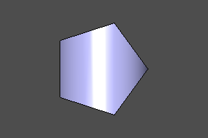
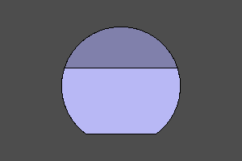

:ru
# Булевы операции.

CSG геометрия операется на булевы операции. В zencad представлены операции объединения, вычитания и пересечения 3д и 2д объектов. В zencad есть два группы этих операций: 

* над массивами тел с помощью функций _union_, _difference_, _intersect_
* над парами тел с помощью операторов _+_ _-_ _^_

>! Примечание:
>! Не стоит пытаться с помощью булевых операций получить составную линию из простых линий или сшить оболочку из граней. Для этих манипуляций, существуют специальные процедуры сшивки, освещенные в соответствующих разделах.
:en
# Boolean operations.

CSG geometry is operated on boolean operations. Zencad provides operations for joining, subtracting and intersecting 3d and 2d objects. There are two groups of these operations in zencad:

* over arrays of bodies using the functions _union_, _difference_, _intersect_
* over pairs of bodies using the operators _ + _ _-_ _ ^ _

>! Note:
>! Do not attempt to boolean a compound line from simple lines or sew a shell from faces. For these manipulations, there are special stitching procedures outlined in the relevant sections. 
::

---
:ru
## Объединение тел.
:en
## Union.
::

Сигнатура:
```python
# Функция:
result = union(array)

# Оператор:
result = shp0 + shp1
```

Пример:
```python
#with operators:
sphere(r=10) + cylinder(r=5, h=10, center=True) + cylinder(r=5, h=10, center=True).rotateX(deg(90))

#with function:
union([
	sphere(r=10), 
	cylinder(r=5, h=10, center=True), 
	cylinder(r=5, h=10, center=True).rotateX(deg(90))
])
```
    </br>
   

---
:ru
## Вычитание тел.
:en
## Difference.
::
Сигнатура:
```python
# Функция:
result = difference(array)

# Оператор:
result = shp0 - shp1
```

Пример:
```python
#with operators:
sphere(r=10) - cylinder(r=5, h=10, center=True) - cylinder(r=5, h=10, center=True).rotateX(deg(90))

#with function:
difference([
	sphere(r=10), 
	cylinder(r=5, h=10, center=True), 
	cylinder(r=5, h=10, center=True).rotateX(deg(90))
])
```
    </br>
   

---
:ru
## Пересечение тел.
:en
## Intersect.
::

Сигнатура:
```python
# Функция:
result = intersect(array)

# Оператор:
result = shp0 ^ shp1
```

Пример:
```python
#with operators:
sphere(r=10) ^ cylinder(r=5, h=10, center=True) ^ cylinder(r=5, h=10, center=True).rotateX(deg(90))

#with function:
intersect([
	sphere(r=10), 
	cylinder(r=5, h=10, center=True), 
	cylinder(r=5, h=10, center=True).rotateX(deg(90))
])
```
    </br>
   

---
:ru
## Пересечение оболочек.
Побратим операции _intersect_, производящий вычисление пересечения оболочек тел.  
:en
## Crossing shells.
Let's twin the operation _intersect_, which calculates the intersection of the shells of bodies. 
::

Сигнатура:
```python
# Функция:
result = section(a, b)
```

Пример:
```python
m0 = section(box(10, center=True) - sphere(4))
m1 = section(box(10, center=True), sphere(7))

```

   

---------------------------------------------
:ru
## Булевы операции над двумерными телами.
Точно также как и к трёхмерным объектам, перечисленные выше операции могут применяться к двумерным объектам до тех пор, пока они находятся в одной плоскости.
:en
## Boolean operations on 2D solids.
Just like with 3D objects, the above operations can be applied to 2D objects as long as they are in the same plane. 
::

Пример:
```python
m0 = sphere(10) - square(10)
m1 = sphere(10) + square(10)
m2 = sphere(10) ^ square(10)
m2 = section(sphere(10), square(10))
```

  </br>
 
