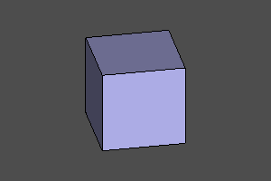
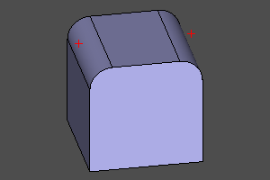
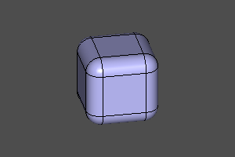
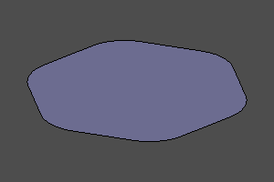
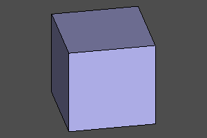
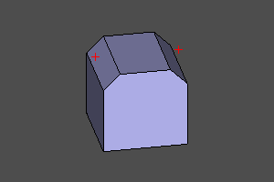
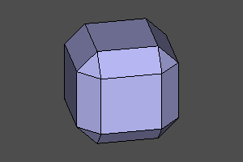
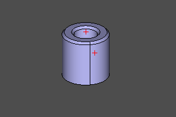
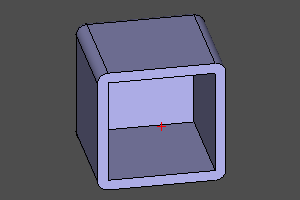
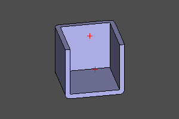

:ru
# Топологически зависимые преобразования

Существует класс операций, требующий в качестве параметра выбрать элемент топологии модели. В интерактивных CAD мы можем, используя указатель мыши, выделить такой элемент и указать в качестве параметра. Этот метод недоступен в скриптовом CAD. Общий подход ZenCad состоит в том, что такой элемент задаётся методом "ближайшей точки". При задании аргумента, вместо элемента топологии задаётся точка. Выбранным считается элемент, растояние до которого от элемента топологии будет минимальным. 
:en
# Topologically dependent transformations

There is a class of operations required as part of the model topology. In interactive CAD, we can, using the mouse pointer, point to such an element and point it as a guide. This method is not available in scripted CAD. The general approach of ZenCad is that such an element is specified using the "closest point" method. When specifying an argument, a point is specified instead of a topology element. The selected element is the element, the distance to which from the topology element will be minimal. 
::

---
:ru
## Fillet
Операция скругления тела. 
Если тело объёмное - модификации подвергаются ребра. Если плоское - вершины.
Скругления задаются радиусом `r` и масивом ближайших точек `refs`. Если `refs == None`, выбранными считаются все элементы топологии. 
:en
## Fillet
Body rounding operation.
If the body is solid, the edges are modified. If flat - tops.
Fillets are specified by radius `r` and an array of nearest points`refs`. If `refs == None`, all elements of the topology are considered selected. 
::

```python
fillet(proto=model, r=radius, refs=referencedPoints)
fillet(proto=model, r=radius)
model.fillet(radius, referencedPoints)
model.fillet(radius)
```
  </br>
  </br>
   

---
:ru
## Chamfer
Операция взятия фаски тела. В отличие от скругления применяется только к объёмным телам.
Фаска задаётся расстоянием `r`, взятым от ребра до линии фаски и масивом ближайших точек `refs`. Если `refs == None`, выбранными считаются все элементы топологии. 

TODO: несиметричная фаска. 
:en
## Chamfer
Body chamfering operation. Unlike rounding, it is applied only to solid bodies.
The chamfer is specified by the distance `r` taken from the edge to the chamfer line and an array of the nearest points` refs`. If `refs == None`, all elements of the topology are considered selected.

TODO: asymmetrical chamfer. 
::

```python
chamfer(proto=model, r=radius, refs=referencedPoints)
```
  </br>
 

---
:ru
## Thicksolid
Операция создания тонкостенного объёмного тела.
Задаётся прототипной моделью `shp` и массивом точек, ближайших к удаляемым граням `refs`.
Также задаётся толщина стенок `t`. Если толщина стенок положительная, стенки наращиваются наружу. Если отрицательная - внутрь.
:en
## Thicksolid
The operation of creating a thin-walled volumetric body.
Defined by the prototype model `shp` and an array of points closest to the removed faces` refs`.
The wall thickness `t` is also specified. If the wall thickness is positive, the walls grow outward. If negative - inward. 
::

```python
thicksolid(proto=model, t=thickness, refs=referencedPoints)
```

   