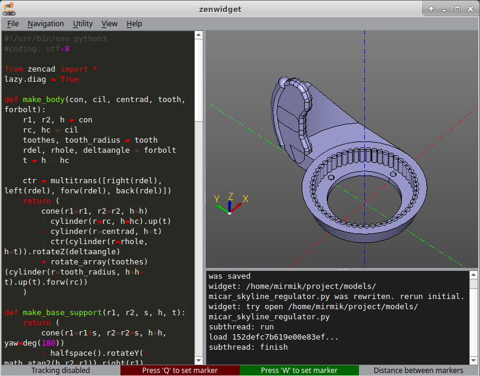

# Графический интерфейс, основные моменты.

## Вызов
Окно графического интерфейса может быть вызвано следующими способами:

* Вызов `zencad.show()` в интерпретаторе python.  
* Выполнение `python3 -m pip zencad` в среде терминала. (usage: `python3 -m pip zencad [filepath]`)  
* Вызов утилиты командной строки `zencad` (usage: `zencad [filepath]`)  

## Обновление модели по обновлению файла источника
Визуализатор отслеживает изменения файла, источника геометрии. По обновлению источника, программа автоматически начинает перевыполнение скрипта. Следует учесть, что реализация этой функциональности выполняется путём изменения работы функции `zencad.show()` (То есть, есть разница в запуске скрипта из терминала, или из программы визуализатора).  

## Встроенный текстовый редактор
Визуализатор имеет встроенный виджет текстового редактора, который может быть использован для быстрого редактирования или проведения экспериментов. Отображение редактора `View/'Hide editor'`

## Встроенная консоль
ZenCad также ретранслирует вывод терминала на встроенную консоль. Отображение консоли `View/'Hide console'`.
Это может использоваться в случае, когда вывод основного терминала недоступен.

## Маркеры, определение координат
Для установки маркеров следует используются клавиши `Q(F1)`, `W(F2)`. После установки координаты маркера выводятся в соответствующем поле. Если установлены оба маркера, дистанция между ними отображается в поле Distance.

## 3D навигация
Вращение: MouseLeftClick/Alt + MouseMove
Смещение: MouseRightClick/Shift + MouseMove
Масштабирование: PgUp/PgDown/MouseWheel