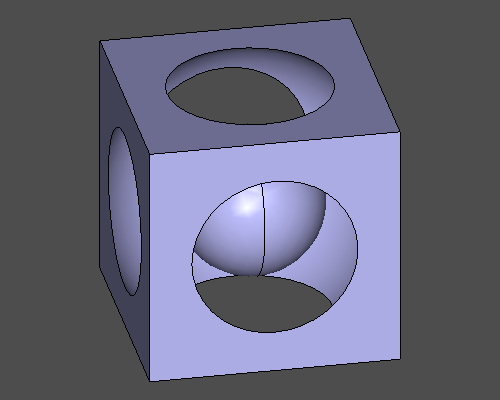

<div class="home-hero">
<h1>ZenCad.</h1>
<p class="home-tagline">Скриптовый CAD для праведных прогеров.</p>

</div>

## Что это?

ZenCad - это библиотека параметрического 3д моделирования. Библиотека исповедует идею создания 3д модели путём написания скрипта, и ноги её растут из системы OpenScad. В отличие от OpenScad, библиотека использует геометрическое ядро граничного представления OpenCascade и язык общего назначения Python.

ZenCad может использоваться как самостоятельная система быстрого прототипирования для целей макетирования или 3д печати, так и в комплексе с библиотеками экосистемы Python, в частности для построения 3д моделей на основе расчетов выполненных в таких системах как scipy и sympy.

Инструкции для разработки и установки находятся на странице [Установка](installation.html).

# Быстрый старт.

------------
## Установка.
```sh
python3 -m pip install "zencad[gui]"
```

--------------
## Запуск графической оболочки.
```sh
zencad

# alternate:
python3 -m zencad
```

-------------
## HelloWorld
```python
#!/usr/bin/env python3
#coding: utf-8

from zencad import *

box = box(200, 200, 200, center = True)
sphere1 = sphere(120)
sphere2 = sphere(60)

model = box - sphere1 + sphere2

display(model)
show()
```

---------
## Ссылки
github: [https://github.com/mirmik/zencad](https://github.com/mirmik/zencad)  
pypi: [https://pypi.org/project/zencad](https://pypi.org/project/zencad)  
