# Ссылочная геометрия

## Linear extrude
Операция линейной экструзии. Самый часто используемый метод придания объёма плоскому объекту.
Задаётся плоским объектом `face` и вектором `vec` вдоль которого будет выполнено растяжение. Если вместо вектора указать одну координату, модель будет вытянута в положительном направлении оси Z.
При указании опции center, после выполнения операции модель будет транслирована в направлении обратном vec на его половинную длину.

```python
linear_extrude(proto=face, vec=(x,y,z), center=True/False)
linear_extrude(proto=face, vec=z, center=True/False) #equal: vec=(0,0,z)
model.extrude(vec=(x,y,z), center=True/False)
model.extrude(vec=z, center=True/False)
```
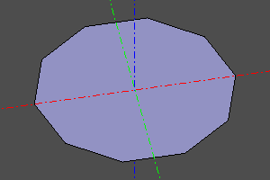
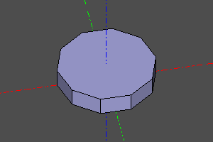  
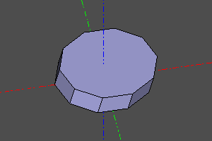
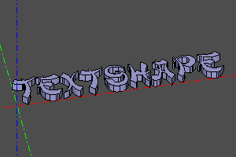  

---
## Loft
Операция натягивает 3д поверхность на масив каркасных линий `wires`.  
TODO: Добавить больше параметров в алгоритм сглаживания.

```python
loft(wires)
```

  

  

  

---
## Sweep
Операция выдавливания тела `shp` по траектории. В текущей реализации профиль задаётся замкнутым контуром. Путь `path` задаётся линией. При установке опции frenet меняется алгоритм расчета поворота сечения от поворота траектории. Эту опцию рекомендуется устанавливать для спирального свипа (см. [https://en.wikipedia.org/wiki/Frenet-Serret_formulas](https://en.wikipedia.org/wiki/Frenet%E2%80%93Serret_formulas)).  
```python
sweep(proto=profile, path=trajectory, frenet=True/False)
```
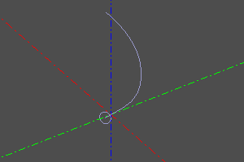
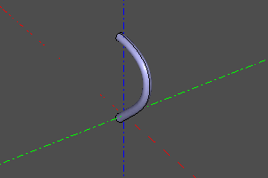  
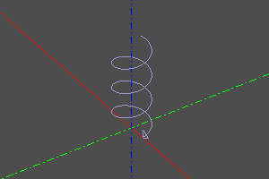
  
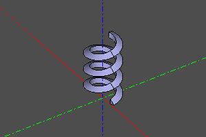

---
## Тело вращения.
Операция создания тела вращения. Задаётся с указанием вращаемого тела. При необходимости создания сектора задаётся угол.
```python
revol(proto=model, r=None, yaw=angle)
revol(proto=model)
```
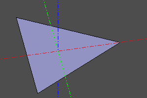
  
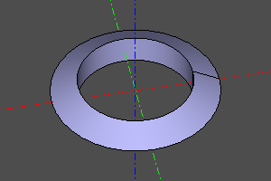
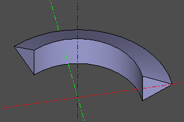  

---
## Тело вращения. (расширенная версия).
Расширенная версия операции _revol_. Строит тело вращения от прототипа _proto_ на интервале угла поворота _yaw_. Указание опции _roll_ позволяет изменять угол поворота прототипа по мере прохождения интервала. Тело строится по опорным копиям тела прототипа, количество копий задаётся опцией _n_. _nparts_ определяет количество сегментов результирующего тела вращения.

Сигнатура:
```python
revol2(proto, r, n=30, yaw=(0,deg(360)), roll=(0,0), nparts=None)
```
