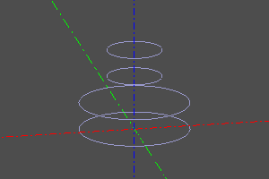
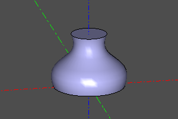
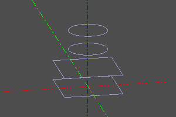
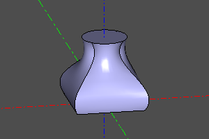

# Ссылочная геометрия

---
## Cмещение.
Путём смещения оболочек, строит утолщённое/утончённое тело на основании прототипа _proto_ и радиуса утолщения _r_. Если _r_ положительный, оболочка смещается наружу, если отрицательный - внутрь.

Сигнатура:
```python
offset(proto, r)
```

Пример:
```python
offset(cone(r1=15,r2=10,h=20), r=5)
```


---
## Линейчатая поверхность.
Строит грань, задаваемую линейчатое поверхностью, опирающейся на линии _a_, _b_.

Сигнатура:
```python
ruled(a, b)
```

Пример:
```python
ruled(circle(r=20, wire=True), circle(r=20, wire=True).up(20))
ruled(circle(r=20, wire=True), circle(r=20, wire=True).rotZ(math.pi/2*3).up(20))
ruled(
    interpolate([(0,0),(-4,10),(4,20),(-6,30),(6,40)]),
    interpolate([(0,0),(-2,10),(2,20),(-4,30),(4,40)]).up(20),
)
```


  
 


---
## Увязка 
Построение оболочки на масиве каркасных линий _profiles_. При активации опции _shell_ вместо твёрдого тела строится оболочка. Активации опции _smooth_ изменяет режим линейчатой поверхности на гладкую апроксимацию. При активной апроксимации опция _maxdegree_ ограничивает максимальную степень полинома.

Сигнатура:
```python
loft(profiles, smooth=False, shell=False, maxdegree=4)
```

Пример:
```python
```


  

  

  
