# Операции генерации линий.
Линии могут использоваться как части составных граней (см. операции `sew` и `fill`), а также как аргументы для операций ссылочной геометрии. 

---
## segment
Отрезок линии задаётся двумя точками.
```python
segment(pnt1, pnt2)
```
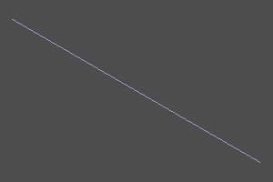

---
## polysegment
Полисегмент - ломанная линия. Задаётся масивом точек. Установка флага `closed` добавляет сегмент полилинии, идущий от точки конца к точке начала. `pnts` - массив точек.
```python
polysegment(pnts, closed=True/False)
```
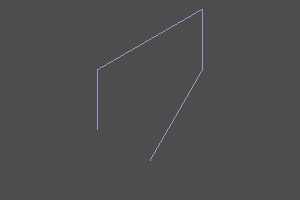
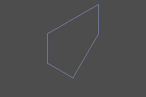  

---
## interpolate
Инструмент для построения bspline по набору точек `pnts`. Также можно указать тангенсы `tangs` линии в каждой точке (нулевой мектор соответствует неуказанному тангенсу). Установка флага `closed` добавляет замыкающий участок кривой.
```python
interpolate(pnts, tangs=[], closed=False)
```
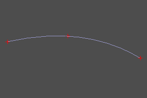
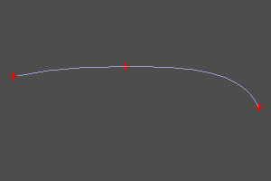  
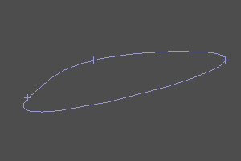
  


---
## circle_arc
Данный метод представляет альтернативный к `circle` (см. [Плоские примитивы](prim2d.html)) метод генерации дуги окружности по трем точкам.
```python
circle_arc(p1, p2, p3) 
```
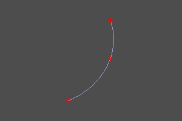

---
## helix
Восходящая спираль. Задается радиусом, высотой и шагом витка. При установке опции `left`, меняет правую навивку на левую. При установке angle, радиус линейно меняется со сменой высоты.

```python
helix(r, h, step, left=True/False)
helix(r, h, step, angle=angle, left=True/False)
```
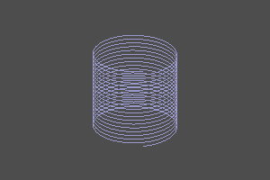
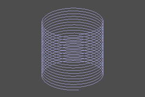  
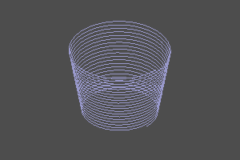
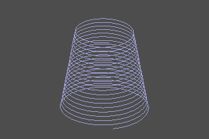  

---
## bezier
Кривая Безье ([wiki](https://en.wikipedia.org/wiki/B%C3%A9zier_curve)).
Задаётся массивом опорных точек и массивом весов (опционально).
Если веса не заданы, все веса считаются равными единице.
```python
bezier(pnts)
bezier(pnts, weights)
```

  

---
## bspline
Создать BSpline прямым заданием параметров.
```python
bspline(pnts, knots, muls, degree, periodic=False/True)
bspline(pnts, knots, weights, muls, degree, periodic=False/True, check_rational=False/True)

default: 
	periodic=False
	check_rational=True
```

  
