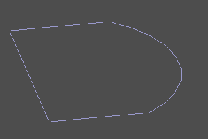

# Кривые и циклы.

Во многих случаях объёмных и плоских примитивов недостаточно для построения требуемой геометрии. Продвинутые операции, из числа тех, что встречаются в данном руководстве позволяют строить геометрические тела на основе произвольных линий.

В _ZenCad_ (и геометрическом ядре opencascade) существует два класса одномерных геометрических тел - _Edge_ и _Wire_. _Edge_ является простым примитивом. Объединение нескольких Edge в одну составную кривую порождают объект Wire. Как правило, в _ZenCad_, _Wire_ и _Edge_ могут использоваться взаимозаменяемо, однако при анализе модели с использованием рефлексии эта разница может быть существенной.")

Набор _Wire_ и/или _Edge_ может быть соединён в сложную кривую с помощью функции _sew_ (Подробнее ниже в этом разделе).

Замкнутые кривые называются циклами. Если кривая (все составные кривые) цикла лежит в одной плоскости, то такой цикл может быть преобразован в грань (Face) при помощи функции _fill_ (см. раздел "Плоские примитивы".).

Некоторые дополнительные операции при работе с кривыми описаны в разделе "Анализ кривых".

---
## Cегмент.
Отрезок линии задаётся двумя точками.

Сигнатура:
```python
segment(pnt1, pnt2)
```


---
## Полисегмент.
Полисегмент - ломанная линия. Задаётся масивом точек. Установка флага `closed` добавляет сегмент полилинии, идущий от точки конца к точке начала. `pnts` - массив точек.

Сигнатура:
```python
polysegment(pnts, closed=True/False)
```

  

---
## Интерполяция по точкам.
Инструмент для построения интерполированной кривой, проходящей через набаор точек _pnts_. С помощью необязательного параметра _tangs_ в каждой точке можно задать направление, под которым кривая пройдёт через точку (нулевой вектор соответствует произвольному пересечению). Установка флага `closed` добавляет замыкающий участок кривой.

Сигнатура:
```python
interpolate(pnts, tangs=[], closed=False)
```

  

  


---
## Дуга окружности по трём точкам.
Данный метод представляет альтернативный к _circle_ (см. [Плоские примитивы](prim2d.html)) метод генерации дуги окружности по трем точкам.
Сигнатура:
```python
circle_arc(p1, p2, p3) 
```


---
## Восходящая спираль.
Восходящая спираль. Задается радиусом _r_, высотой _h_ и шагом витка _step_. При установке опции _left_, меняет правую навивку на левую. При установке необязательно параметра _angle,_ радиус меняется со сменой высоты по коническому закону.

Сигнатура:
```python
helix(r, h, step, angle=angle, left=True/False)
```

  

  

---
## Кривая Безье.
Кривая Безье ([wiki](https://en.wikipedia.org/wiki/B%C3%A9zier_curve)).
Задаётся массивом опорных точек и массивом весов (опционально).
Если веса не заданы, все веса считаются равными единице.

Сигнатура:
```python
bezier(pnts)
bezier(pnts, weights)
```

  

---
## BSpline.
Создать BSpline прямым заданием параметров.

Сигнатура:
```python
bspline(pnts, knots, muls, degree, periodic=False/True)
bspline(pnts, knots, weights, muls, degree, periodic=False/True, check_rational=False/True)

default: 
	periodic=False
	check_rational=True
```

  

---
## Создание сложной кривой. (sew)
Операция _sew_ собирает сложную линию из массива частей _wires_. 

В качестве элементов массива _wires_ могут выступать объекты типов Edge и Wire ([см. геометрические типы](https://mirmik.github.io/zencad/ru/geomcore.html)) 

Требования. Части линии обязательно должны граничить друг с другом. Порядок следования не должен быть нарушен. Если аргумент _sort_ установлен, алгоритм постарается автоматически отсортировать входящие линии в правильном порядке.

Сигнатура:
```python
sew(wires, [sort=True])
```

Пример:
```python
sew([
	segment((0,0,0), (0,10,0)), 
	circle_arc((0,10,0),(10,15,0),(20,10,0)), 
	segment((20,0,0), (20,10,0)),
	segment((20,0,0), (0,0,0))
])
```

