:ru
# Плоские примитивы.
В этом разделе приводятся плоские примитивы. Обычно они используются совместно с 3д операциями для построения тел со сложной геометрией.
:en
# Flat primitives.
This section introduces flat primitives. They are usually used in conjunction with 3D operations to construct bodies with complex geometry. 
::

---
:ru
## Прямоугольник
Плоский примитив - прямоугольник. Задаётся двумя сторонами. Допустимо не указывать вторую сторону, что будет соответствовать построению квадрата. Установка опции _center_ совмещает геометрический центр тела с началом координат. При установке опции _wire_ вместо залитой грани будет сгенерирован цикл прямоугольника.
:en
## Rectangle
The flat primitive is a rectangle. Set by two sides. It is permissible not to indicate the second side, which will correspond to the construction of the square. Setting the _center_ option aligns the geometric center of the body with the origin. When the _wire_ option is set, a rectangle loop will be generated instead of a filled face.
::

Сигнатура:
```python
rectangle(x, y, center=True/False, wire=True/False)
rectangle(a, center=True/False, wire=True/False)
square(a, center=True/False, wire=True/False) #alternate
```
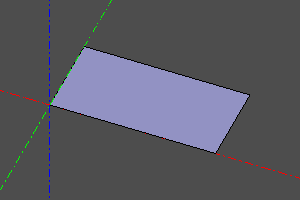 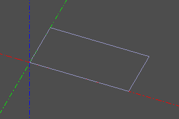 </br> 
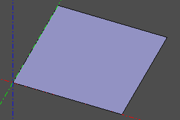 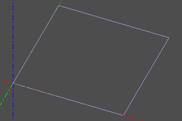 

---
:ru
## Окружность/Круг
Окружность задаётся радиусом _r_. Установка необязательной опции _angle_ позволяет сгенерировать сектор круга / дугу окружности.
При установке опции _wire_ вместо залитой грани круга будет сгенерирована каркасная окружность.
:en
## Circle / Circle
The circle is given by the radius _r_. Setting the optional _angle_ option allows you to generate a sector of a circle / arc of a circle.
When the _wire_ option is set, a wireframe circle will be generated instead of a filled circle face. 
::

Сигнатура:
```python
circle(r=radius, wire=True/False)
circle(r=radius, angle=angle, wire=True/False)
circle(r=radius, angle=(start, stop), wire=True/False)
```
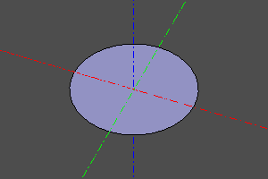 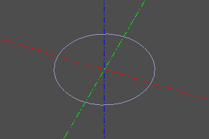   </br>
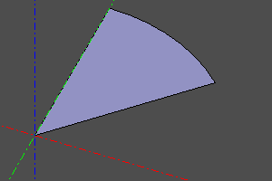 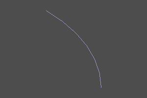  

---
:ru
## Элипс
Плоский примитив - эллипс. Задаётся двумя радиусами, причем _r1_ должен быть больше _r2_. Также можно построить сектор, указав угол или пару углов как необязательный параметр _angle_.
При установке опции _wire_ вместо залитой грани будет сгенерирован каркас.
:en
## Ellipse
The flat primitive is an ellipse. It is specified by two radii, and _r1_ must be greater than _r2_. You can also draw a wedge by specifying an angle or a pair of angles as the optional _angle_ parameter.
When the _wire_ option is set, a wireframe will be generated instead of a filled face. 
::

Сигнатура:
```python
ellipse(r1=major, r2=minor, wire=True/False)
ellipse(r1=major, r2=minor, angle=angle, wire=True/False)
ellipse(r1=major, r2=minor, angle=(start, stop), wire=True/False)
```
 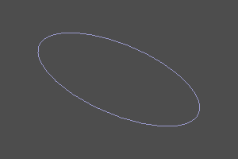   </br>
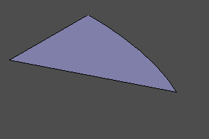 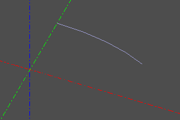  

---
:ru
## Полигон
Плоский примитив - полигон. Строится по точкам вершин.
При установке опции _wire_ вместо залитой грани будет сгенерирован каркас (что аналогично закрытому полисегменту.).
_pnts_ - массив точек вершин.
:en
## Polygon
A flat primitive is a polygon. Constructed by vertex points.
When the _wire_ option is set, a wireframe will be generated instead of a filled face (which is similar to a closed polysegment.).
_pnts_ is an array of vertex points. 
::

Сигнатура:
```python
polygon(pnts=pnts, wire=True/False)
```
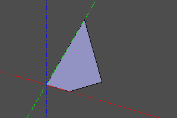   

---
:ru
## Правильный многоугольник
Плоский примитив - правильный многоугольник. Задаются радиус и количество вершин.
При установке опции _wire_ вместо залитой грани будет сгенерирован каркас.
:en
## Regular polygon
A flat primitive is a regular polygon. The radius and the number of vertices are set.
When the _wire_ option is set, a wireframe will be generated instead of a filled face. 
::

Сигнатура:
```python
ngon(r=radius, n=vertexCount, wire=True/False)
```
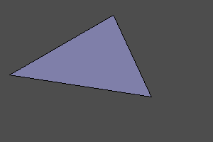 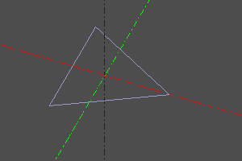  </br> 
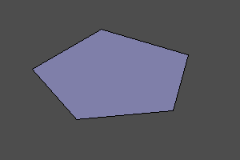   </br> 
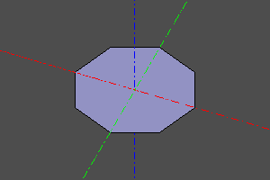   

---
:ru
## Текст
Плоский примитив - текст. Создаёт грань на основе строки `text`, названия шрифта `fontname` и размера шрифта `size`. Шрифт выбирается из числа зарегистрированных в системе. Для регистрации дополнительных шрифтов используйте комманду `register_font`. Опция `composite_curve` Позволяет снизить количество составных объектов результирующей формы путём увеличения их сложности. 
:en
## Text shape
The flat primitive is text. Creates a face based on string `text` and name of font `fontname` with font size `size`. The font is selected from those registered in the system. To register additional fonts use `register_font` command. The `composite_curve` option reduce the number of edges in the resulting shape by increasing their complexity. 
::

Сигнатура:
```python
textshape(text, fontname, size, composite_curve=False)
```
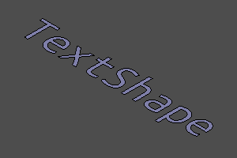 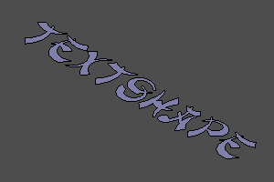  

---
:ru
## Бесконечная плоскость
Бесконечная плоскость - специальный геометрический объект, который может использоваться в некоторых операцих над другими объектами.
Бесконечная плоскость не может быть отображена непосредственно.
:en
## Infinite Plane
An infinite plane is a special geometric object that can be used in some operations on other objects.
An infinite plane cannot be displayed directly. 
::

Сигнатура:
```python
infplane()
```

Пример (Построение конических сечений):
```python
cone(r1=5, r2=0, h=10, center=True) ^ infplane()
cone(r1=5, r2=0, h=10, center=True).rotX(deg(45)) ^ infplane()
cone(r1=5, r2=0, h=10, center=True) ^ infplane().rotX(deg(45))
cone(r1=5, r2=0, h=10, center=True) ^ infplane().rotX(deg(90)).right(3)
```
  </br> 
   

----------------------------------
:ru
## Заполнение контура
Данная операция применяется к плоской замкнутой линии _wire_ и превращает ее в грань.
:en
## Filling the outline
This operation is applied to the flat closed line _wire_ and turns it into a face. 
::

Сигнатура:
```python
fill(wire)
wire.fill() #alternate
```

Пример:
```python
wire = sew([
	segment((0,0,0), (0,10,0)), 
	circle_arc((0,10,0),(10,15,0),(20,10,0)), 
	segment((20,0,0), (20,10,0)),
	segment((20,0,0), (0,0,0))
])
fill(wire)
```

|До|После|
|--|--|
||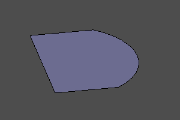|


----------------------------------
:ru
## Интерполяция поверхности по массиву точек
Строит bspline поверхность интерполируя 2д массив точек. Масив задаётся двумерным списком.
degmin и degmax задают минимальную и максимальную степени интерполяционного полинома, соответственно.
:en
## Interpolate a surface over an array of points
Builds a bspline surface by interpolating a 2D array of points. The array is specified by a two-dimensional list.
degmin and degmax define the minimum and maximum degrees of the interpolation polynomial, respectively. 
::

Сигнатура:
```python
interpolate2(pnts, degmin=3, degmax=7)
```

Пример:
```python
POINTS = points2([
		[(0,0,0), (10,0,7), (20,0,5)],
		[(0,5,0), (10,5,7.5), (20,5,7)],
		[(0,10,2), (10,10,8), (20,10,5)],
		[(0,15,1.3), (10,15,8.5), (20,15,6)],
	])

m = interpolate2(POINTS)
disp(m)
disp(POINTS, color=color.red)
```

