:ru
# Объёмные тела
В этом разделе приводятся базовые примитивы CSG геометрии.
:en
# Volumetric bodies
This section provides basic CSG geometry primitives.
::

---
:ru
## Параллелепипед
Объёмное тело - параллелипипед. Задаётся с указанием трёх размеров _x_, _y_, _z_. При указании одного размера _a_ генерируется куб _(a,a,a)_. Установка булевой опции _center_ совмещает геометрический центр тела с началом координат.
:en
## Box
The volumetric body is a parallelepiped. It is set with the indication of three sizes _x_, _y_, _z_. Specifying one dimension _a_ generates a cube _(a, a, a)_. Setting the boolean option _center_ aligns the geometric center of the body with the origin.
::

Сигнатуры:
```python
box(x, y, z, center=True/False)
box(size=(x,y,z), center=True/False)
box(size=a, center=True/False) 
```

Примеры:
```python
box(10, 20, 30, center=False)
box(size=(10,20,30), center=False) # alternate
box(10, center=True)
```

 

---
:ru
## Сфера
Объёмное тело - сфера. Задаётся с указанием радиуса. Возможно построение сектора сферы с использованием необязательных параметров yaw, pitch.
:en
## Sphere
The volumetric body is a sphere. Specified by specifying the radius. It is possible to construct a sector of a sphere using the optional parameters yaw, pitch. 
::

Сигнатура:
```python
sphere(r=radius, yaw=yaw, pitch=(minPitch, maxPitch))
```

Примеры:
```python
sphere(10)
sphere(10, yaw=math.pi*2/3)
sphere(10, pitch=(deg(20), deg(60)))
sphere(10, yaw=deg(120), pitch=(deg(20), deg(60)))
```
 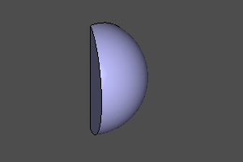 </br>
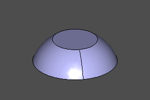 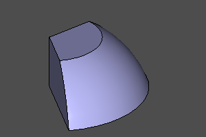

---
:ru
## Цилиндр
Объёмное тело - цилиндр. Задаётся с указанием радиуса и высоты. Возможно построение сектора цилиндра с использованием необязательного параметра _yaw_. Установка опции _center_ совмещает геометрический центр тела с началом координат.
:en
## Cylinder
The volumetric body is a cylinder. It is set with the indication of the radius and height. It is possible to build a cylinder sector using the optional _yaw_ parameter. Setting the _center_ option aligns the geometric center of the body with the origin.
::

Сигнатура:
```python
cylinder(r=radius, h=height, yaw=yaw, center=True/False)
```

```python
cylinder(r=10, h=20)
cylinder(r=10, h=20, yaw=deg(45))
cylinder(r=10, h=20, center=True)
cylinder(r=10, h=20, yaw=deg(45), center=True)
```

 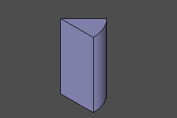 </br>
 

---
:ru
## Конус
Объёмное тело - конус. Задаётся с указанием нижнего радиуса _r1_, верхнего радиуса _r2_ и высоты. Возможно построение сектора конуса с использованием необязательного параметра _yaw_. Установка опции _center_ совмещает геометрический центр тела с началом координат. Радиусы _r1_ и _r2_ могут равняться нулю, что соответствует остроконечному конусу.
:en
## Cone
The volumetric body is a cone. It is specified by specifying the lower radius _r1_, upper radius _r2_ and height. It is possible to create a cone sector using the optional _yaw_ parameter. Setting the _center_ option aligns the geometric center of the body with the origin. The radii _r1_ and _r2_ can be zero, which corresponds to a pointed cone. 
::

Сигнатура:
```python
cone(r1=botRadius, r2=topRadius, h=height, yaw=yaw, center=True/False)
```

Примеры:
```python
cone(r1=20, r2=10, h=20)
cone(r1=20, r2=10, h=20, yaw=deg(45))
cone(r1=0, r2=20, h=20)
cone(r1=20, r2=0, h=20, center=True)
```

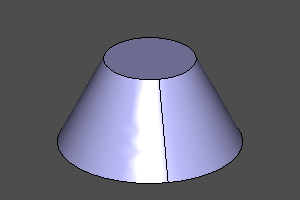 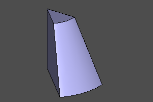 </br>
 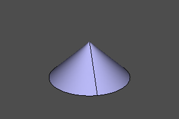

---
:ru
## Тор
Объёмное тело - тор. Задаётся с указанием центрального радиуса _r1_ и локального радиуса _r2_. Возможно построение секторов тора с использованием необязательных параметров _yaw_, _pitch_. 

В случае, если интервал угла _pitch_ не содержит внутренней области, в центре образуется соответствующая цилиндрическая вставка. Если интервал угла _pitch_ не содержит внешней области, соответствующая часть тора ограничивается плоскостью.
:en
## Torus
The volumetric body is a torus. It is specified by specifying the central radius _r1_ and the local radius _r2_. It is possible to construct torus sectors using the optional parameters _yaw_, _pitch_.

If the interval of the _pitch_ angle does not contain an inner region, a corresponding cylindrical insert is formed in the center. If the interval of the _pitch_ angle does not contain an outer region, the corresponding part of the torus is bounded by the plane. 
::

Сигнатура:
```python
torus(r1=centralRadius, r2=localRadius, yaw=yaw, pitch=(minPitch, maxPitch))
```

Примеры:
```python
torus(r1=20, r2=5)
torus(r1=20, r2=5, yaw=deg(120))
torus(r1=20, r2=5, pitch=(deg(-20), deg(120)))
torus(r1=20, r2=5, pitch=(deg(-20), deg(120)), yaw=deg(120))
torus(r1=20, r2=5, pitch=(deg(-140), deg(140)), yaw=deg(120))
torus(r1=20, r2=5, pitch=(deg(-20), deg(190)), yaw=deg(120))
```

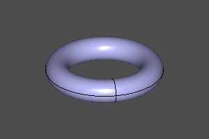  </br>
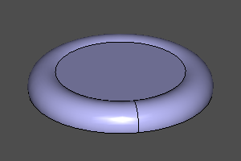 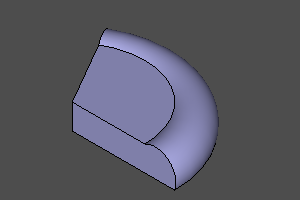 </br>
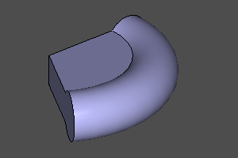 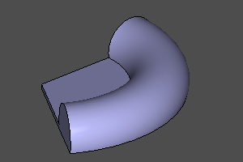

---
:ru
## Полупространство
Специальное объёмное тело, представляющее собой нижнее полупространство. Так же как и остальные объёмные тела, поддерживает трансформации и с использованием их может представлять любое возможное полупространство. В отличии от обычных тел не может быть отображено непосредственно. Используется вместе с операциями разности и пересечения.
:en
A special volumetric body, which is the lower half-space. Like other solid bodies, it supports transformations and, using them, can represent any possible half-space. Unlike ordinary bodies, it cannot be displayed directly. Used in conjunction with the difference and intersection operations. 
::

```python
sphere(r=10) - halfspace().rotateX(deg(150))
sphere(r=10) ^ halfspace().rotateX(deg(150))
```
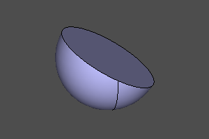 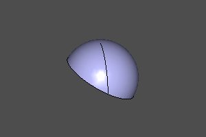  

--------------------
:ru
## Платоновы тела

Построение платоновых тел.
Библиотека основана на https://github.com/qalle2/plato.scad

|Правильный многогранник|Число вершин|Число рёбер|Число граней|Число сторон у грани|Число рёбер примыкающих к вершине|Тип пространственной симметрии|
| ---      |--- |--- |--- |--- |--- |--- |
| Тетраэдр | 4  | 6  | 4  | 3  | 3  | Td |
| Гексаэдр | 8  | 12 | 6  | 4  | 3  | Oh |
| Октаэдр  | 6  | 12 | 8  | 3  | 4  | Oh |
| Додекаэдр| 20 | 30 | 12 | 5  | 3  | Ih |
| Икосаэдр | 12 | 30 | 20 | 3  | 5  | Ih |

Библиотека позволяет указывать размеры тел через радиус описанной окружности _r_ или через длину ребра _a_.
:en
## Platonic solids

Construction of Platonic solids.
The library is based on https://github.com/qalle2/plato.scad

| Regular polyhedron | Number of vertices | Number of edges | Number of faces | Number of sides at a face | Number of edges adjacent to a vertex | Type of spatial symmetry |
| ---          | ---| ---| ---| ---| ---| ---|
| Tetrahedron  | 4  | 6  | 4  | 3  | 3  | Td |
| Hexahedron   | 8  | 12 | 6  | 4  | 3  | Oh |
| Octahedron   | 6  | 12 | 8  | 3  | 4  | Oh |
| Dodecahedron | 20 | 30 | 12 | 5  | 3  | Ih |
| Icosahedron  | 12 | 30 | 20 | 3  | 5  | Ih |

The library allows you to specify the dimensions of bodies through the radius of the circumscribed circle _r_ or through the length of the edge _a_. 
::

Сигнатуры:
```python
zencad.tetrahedron(r=1, a=None, shell=False)
zencad.hexahedron(r=1, a=None, shell=False)
zencad.octahedron(r=1, a=None, shell=False)
zencad.dodecahedron(r=1, a=None, shell=False)
zencad.icosahedron(r=1, a=None, shell=False)

# Альтернативный синтаксис
zencad.platonic(nfaces, r=1, a=None, shell=False)
```

Пример:
```python
# Через радиус:
tetrahedron(10)
hexahedron(10)
octahedron(r=10)
dodecahedron(r=10)
icosahedron(10)

# Через длину ребра:
icosahedron(a=10)

# Альтернативный синтакис:
zencad.platonic(4, 10)
zencad.platonic(6, 10)
zencad.platonic(8, 10)
zencad.platonic(12, 10)
zencad.platonic(20, 10)
```

  </br>
  </br>

